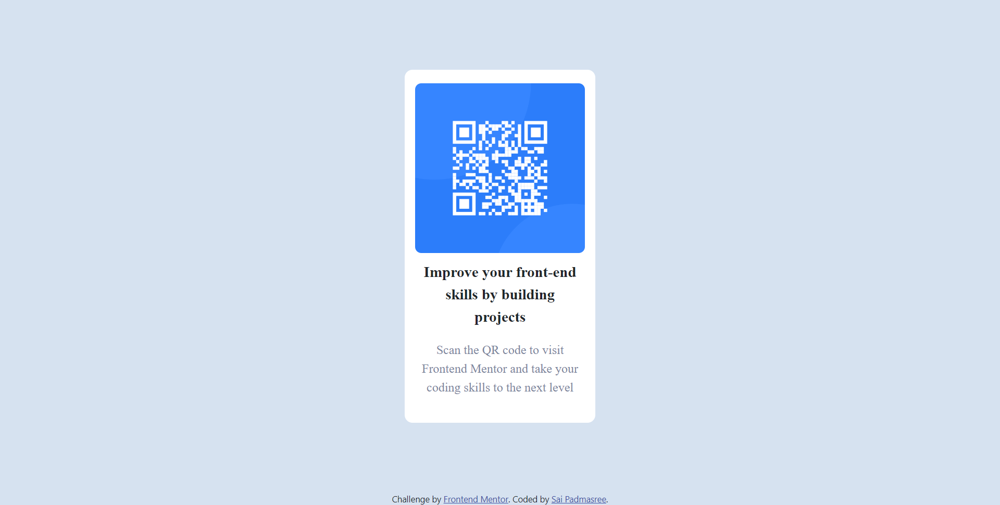

# Frontend Mentor - QR code component solution

This is a solution to the [QR code component challenge on Frontend Mentor](https://www.frontendmentor.io/challenges/qr-code-component-iux_sIO_H). Frontend Mentor challenges help you improve your coding skills by building realistic projects. 

## Table of contents

- [Overview](#overview)
  - [Screenshot](#screenshot)
  - [Links](#links)
- [My process](#my-process)
  - [Built with](#built-with)
  - [What I learned](#what-i-learned)
- [Author](#author)

## Overview
The challenge is to build the QR Code Component and make it look as close to the given design as possible using tools of any choice.

### Screenshot

### Links

- Solution URL: https://github.com/PADMASREE1999/QR-Code-Component
- Live Site URL: https://padmasree1999.github.io/QR-Code-Component/

## My process

I have used the basic template provided for the challenge and expanded it. I have divided every part into a different div block, like the QR image on one div and the content in seperate divs. Once I was done with the html content, I started working on the css by adjusting the padding, margins, fonts, color, etc. 

### Built with

- Semantic HTML5 markup
- CSS custom properties
- Flexbox
- CSS Grid

### What I learned

This challenge has helped me revise the CSS concepts related to padding and font-face. 

## Author

- Frontend Mentor - [@PADMASREE1999](https://www.frontendmentor.io/profile/PADMASREE1999)

